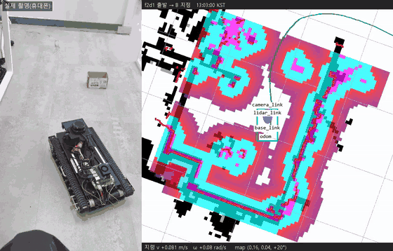
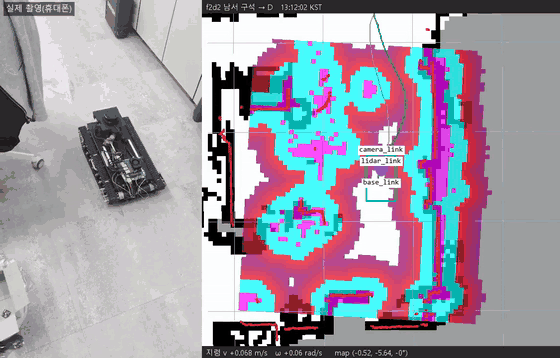

# Indoor Rover

소형 궤도형 로버의 자율주행 소프트웨어 스택(펌웨어 → 센서 융합 → SLAM → 자율주행)을 직접 구축하고 실제 사무실에서 검증하는 개인 프로젝트입니다.

  
  

왼쪽: 실제 촬영 · 오른쪽: 같은 시각 ROS 2 bag(로컬 코스트맵·라이다·계획 경로·궤적), 3배속

## 구현한 기능

- **펌웨어** — STM32F405 + FreeRTOS + micro-ROS. 속도 제어, 스톨 보호(무이동 감지·자동 복구·래치), `/cmd_vel` 워치독. App / HAL / Driver 계층 분리
- **센서 융합** — robot_localization EKF(휠 + 카메라 IMU 자이로) + 라이다 스캔 정합(rf2o) 게이트: 제자리 회전 중 트랙 미끄러짐 추정, 사람 가림·오염 거부
- **위치 추정** — slam_toolbox(제자리 회전 중에도 스캔 처리하도록 수정한 포크) 저장 지도 위 위치 추정
- **장애물 인식** — RealSense 깊이를 nvblox(Isaac ROS, GPU)로 3D 재구성해 라이다와 함께 로컬 코스트맵에 연결
- **자율주행** — Nav2: NavFn 계획 + MPPI 컨트롤러, 경로 막힘 재계획 BT, 무진행 감시

## 작업 절차

1. **기준 선언** — 시험마다 판정 기준을 주행 전에 적는다
2. **측정** — 주행·정지 시험, bag 재생, 합성 데이터(예: 스캔에 사람 몸을 합성)로 확인한다
3. **원인 분리** — 측정과 추정을 구분하고, 기각한 가설과 대안을 남긴다
4. **기록** — `Docs/debug_log/<날짜>/` 에 SUMMARY(시간순)·실행 스크립트·원문 출력. 정정은 지우지 않고 새 항목으로 남긴다

## 문서

- [`PROJECT_OVERVIEW.md`](PROJECT_OVERVIEW.md) — 하드웨어·아키텍처·설계 결정
- [`Docs/INDEX.md`](Docs/INDEX.md) — 단계별 계획·결과 문서 색인
- [`Docs/debug_log/`](Docs/debug_log/) — 실험 기록
