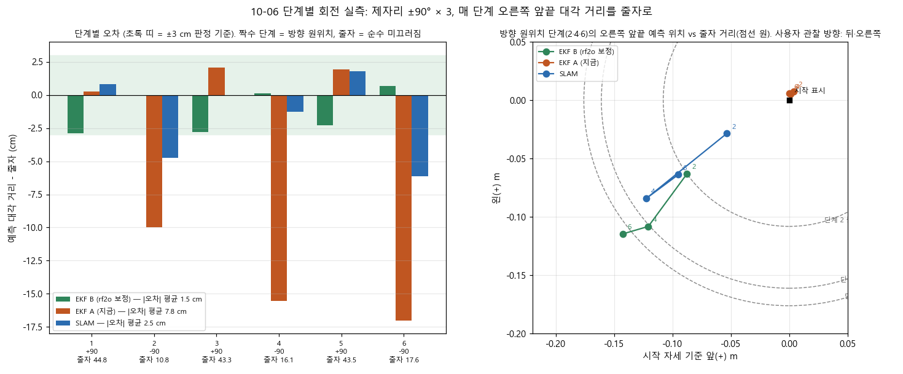
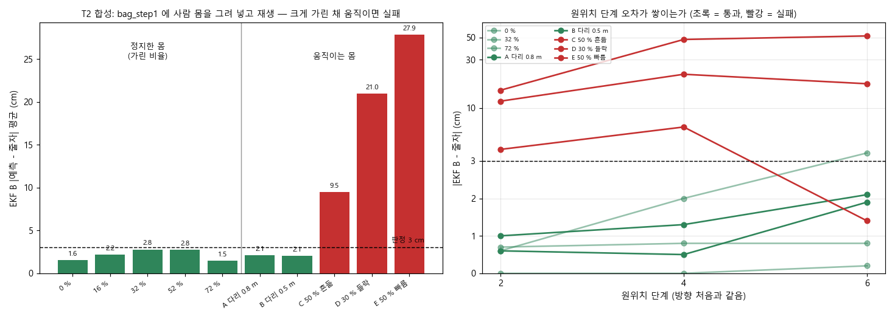

# 실내 자율주행 로버 — 펌웨어부터 자율주행까지 직접 구축

**개인 프로젝트**입니다. 소형 궤도형(탱크) 로버에서 **펌웨어 → 센서 융합 → SLAM → 자율주행**까지의 소프트웨어 스택을 처음부터 직접 만들고, 실제 사무실에서 주행시키며 검증합니다.

이 저장소에서 가장 보여드리고 싶은 것은 결과보다 **과정**입니다. 모든 판단은 주행 전에 판정 기준을 적고, 측정으로 확인하고, 틀린 것은 지우지 않고 정정으로 남기는 방식으로 기록했습니다(`Docs/debug_log/<날짜>/SUMMARY.md`).

---

## 주행 영상 (2026-10-07)

왼쪽은 실제 촬영(휴대폰), 오른쪽은 같은 시각의 로봇 내부 데이터(ROS 2 bag)를 위에서 본 그림입니다. 오른쪽 범례: 분홍 = 로컬 코스트맵 치명 칸(MPPI 컨트롤러가 피하는 것), 주황 테두리 = 전역 코스트맵 치명 칸(경로 계획기가 보는 것), 빨강 점 = 라이다, 보라 점선 = 계획 경로, 초록 = 지나온 궤적. 이미지를 누르면 영상(약 75 초)이 열립니다.

### ① 구석에서 방향 맞추기 정체 → 원인 분석 → '위치만 판정' 으로 해결
[](Docs/showcase/2026-10-07_corner.mp4)

남서 구석 목표에 도착한 뒤 목표 방향(남쪽)으로 돌아야 하는데, 로버가 반대로 돌며 뒤로 물러나 벽에 붙고, 이후 ±0.01 m/s 수준의 지령만 반복하며 움찔거립니다. bag 으로 확인하니 실제 접촉은 없었고(라이다 기준 12 cm), 뒤쪽 4.5 cm 에 있는 코스트맵 치명 칸 때문에 MPPI 가 회전도 전진도 고르지 못한 상태였습니다. 같은 구석에서 3 회 중 3 회 재현되어, 구석 목표는 "위치만 맞으면 도착" 으로 판정하도록 주행 러너를 바꿨고 다음 주행에서 통과했습니다. — `Docs/debug_log/2026-10-07/SUMMARY.md §2.3, §6.2, §7`

### ② 짐 사이 좁은 통로 주행
[](Docs/showcase/2026-10-07_corridor.mp4)

박스·가방이 놓인 서쪽 통로를 지나 문을 통과합니다. 위치 추정은 휠·자이로·라이다 스캔 정합(rf2o)을 융합한 EKF 와 저장 지도 위 slam_toolbox 위치 추정, 장애물은 라이다 + 카메라 3D 재구성(nvblox)입니다.

### ③ 카메라만 보는 낮은 상자 앞에서 정지 → 다음 실험의 동기
[](Docs/showcase/2026-10-07_box.mp4)

라이다(높이 18.5 cm)보다 낮은 상자는 카메라만 볼 수 있습니다. 로버가 가까이 가면 전역 코스트맵에서 상자가 사라지는데, 같은 2D 격자에서 **라이다 빔이 상자 위를 지나가며 카메라 표시를 지우기** 때문이었습니다(설정 + bag 정황). 그 결과 계획기는 "지나갈 수 있다", MPPI 는 "막혔다" 로 판단이 엇갈려 정체했습니다. 이전 주행에서는 같은 이유로 상자를 밀고 지나간 적도 있습니다.
"화각 밖에서는 기억하되, 카메라가 그 자리를 볼 때는 갱신(움직이는 물체를 계속 기억하면 갈 수 있는데도 못 간다)" 이라는 조건으로 카메라 층을 분리해 시험한 결과, **기억은 통과했지만 갱신은 불합격**(치운 뒤 카메라 점은 100 → 0 개인데 칸이 남음)이라 채택하지 않았고, 원인을 찾는 중입니다. — `SUMMARY.md §7.2, §8`

---

## 측정으로 확인한 주요 결과

| 주제 | 결과 | 근거 |
|---|---|---|
| 제자리 회전 미끄러짐 | ±90°×3 회전에 트랙이 실제로 37 cm 미끄러지는데 휠+자이로 EKF 는 0.3 cm 로 봄 → 로컬 코스트맵에 벽이 두껍게 번져 MPPI 실패의 원인 | `debug_log/2026-10-02` §11~§13 |
| rf2o(라이다 스캔 정합) 융합 | 90° 단계 회전 6 회, 줄자 대비 오차 평균 **1.5 cm**(기존 EKF 7.8 cm, SLAM 2.5 cm) | `debug_log/2026-10-06` §4, 그림 아래 |
| 사람 가림 강건성 | 정지한 몸(가림 ≤ 72 %)·걷는 다리는 통과, 크게 가린 채 움직이는 몸은 9.5~27.9 cm 로 실패 → 검사 G4 추가 후 4.5~7.4 cm(3~4 배 감소, 목표 3 cm 는 미달) | `2026-10-06` §10~§12, `2026-10-07` §1 |
| G4 오판 발견·수정 | 실주행 곡선 회전에서 정상 전진을 오염으로 오판(43~58 %) → 휠 속도와의 잔차로 판정을 바꿔 재생 기준 35 → 2 % | `2026-10-07` §3.2, §4 |
| 카메라 장애물 층(nvblox) 이전 | STVL 대비 같은 코스 5/5 성공, 상자 여유 12~15 cm, CPU 는 동등(절감 기대는 미달성) | `Docs/05_nvblox/PHASE_N_RESULTS.md` |
| 보드 자이로 | 손회전 녹화 2 회로 ICM-20948 자이로 무응답 확인 → EKF 자이로를 카메라(D455f) 내장 IMU 로 | `debug_log/2026-08-27` |


*90° 회전마다 줄자로 잰 오른쪽 앞끝 대각 거리와 각 추정값의 차이. 초록(rf2o 융합 EKF)만 모든 단계에서 ±3 cm 안.*


*실측 bag 의 라이다 스캔에 사람 몸을 합성해 다시 재생한 결과. 크게 가린 채 움직이는 몸(빨강)에서 실패 → 다음 단계 설계의 근거.*

---

## 시스템 구성

| 층 | 구성 |
|---|---|
| 차체 | WT-600 강철 궤도 섀시(500×330 mm, 8.5 kg), BLDC 1:90 기어드 모터 ×2(FG 펄스 피드백) |
| 펌웨어 | STM32F405(Cortex-M4F) + FreeRTOS + **micro-ROS** — 속도 제어, 스톨 보호(600 ms 무이동 감지·자동 복구·래치), `/cmd_vel` 500 ms 워치독. App / HAL / Driver 계층 분리 |
| 메인 컴퓨터 | Jetson Orin Nano Super, Ubuntu 22.04, ROS 2 Humble |
| 센서 | RPLidar S2L, Intel RealSense D455f(깊이 + IMU) |
| 위치 추정 | robot_localization EKF(휠 + 카메라 IMU 자이로 + rf2o 게이트) · slam_toolbox(포크: 제자리 회전 중에도 스캔 처리) 저장 지도 위치 추정 |
| 장애물 | 로컬 = nvblox(Isaac ROS, GPU) 2D 슬라이스 + 라이다 · 전역 = 저장 지도 + 라이다 + 카메라 점군 |
| 주행 | Nav2: NavFn + 스무더, **MPPI** 컨트롤러(CostCritic), 사용자 정의 BT(경로 막힘 재계획), 무진행 감시(nav_guard) |

## 기록 방식 (재현성)

- `Docs/debug_log/<날짜>/SUMMARY.md` — 시간순 § 번호. 시험마다 **판정 기준을 주행 전에 선언**하고, 측정과 추정을 구분해 적습니다. 정정은 지우지 않고 새 § 로 남깁니다.
- `jobs/` 실제로 돌린 스크립트, `outputs/` 원문 출력, `bags/` 주행 bag(용량 때문에 저장소 밖 보관).
- 주행마다 git HEAD·주행 인자·파라미터 스냅샷을 bag 과 함께 남겨, 개선 전후를 같은 코스·같은 토픽으로 비교합니다.

## 저장소 지도

```
firmware/rover_jupiter_fw/   STM32F405 펌웨어 (App/ hal/ drivers/ microros/)
ros2_ws/src/                 ROS 2 패키지 — rover_bringup(launch·EKF·rf2o 게이트·컨디셔너), rover_navigation(Nav2 설정·BT)
Docs/01_firmware ~ 05_nvblox 단계별 계획·설계 문서 (색인: Docs/INDEX.md)
Docs/debug_log/<날짜>/       실험 기록
Docs/showcase/               위 주행 영상
PROJECT_OVERVIEW.md          하드웨어 사양·아키텍처·설계 결정 근거
```

## 아직 풀지 못한 것 (솔직하게)

- 카메라만 보는 낮은 물체를 **기억하면서도 볼 때 갱신**하는 전역 장애물 층 — 시험한 구성은 갱신 불합격(위 ③).
- 크게 가린 채 움직이는 사람 앞에서 회전할 때의 위치 오차(4.5~7.4 cm, 목표 3 cm).
- micro-ROS 통신을 2 Mbps → 460.8 kbps 로 낮춰 우회 중 — 같은 설정이 예전에는 됐으므로 회귀이며 원인 미확정.
- 긴 직선에서 가끔 생기는 저속 떨림(TF 지연 가설은 측정으로 기각, 원인 미확정).
